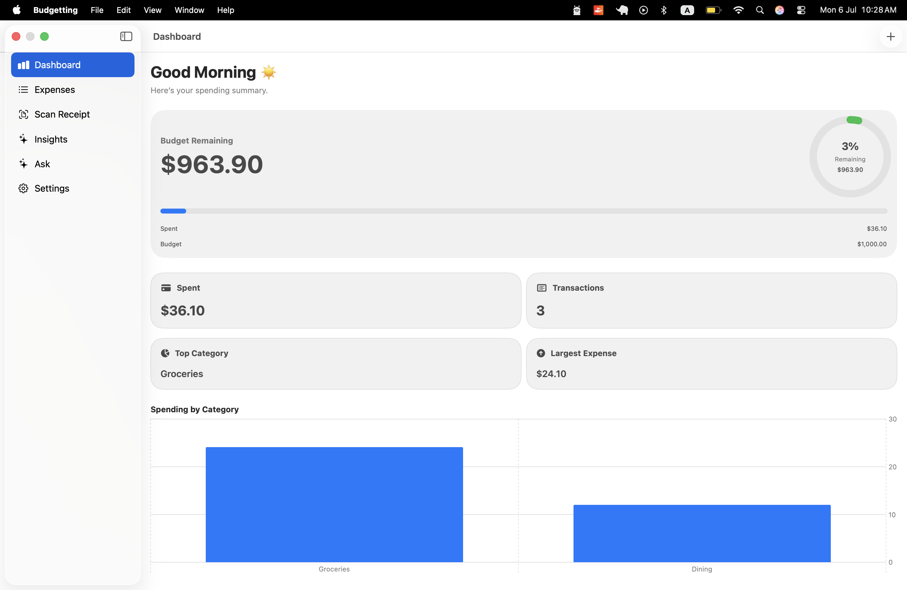
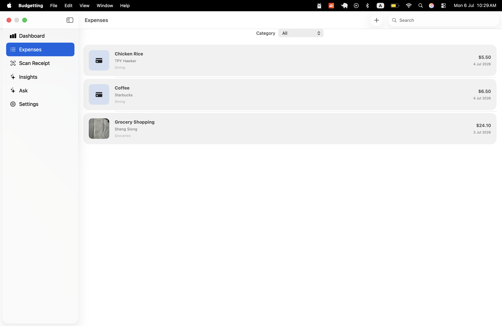
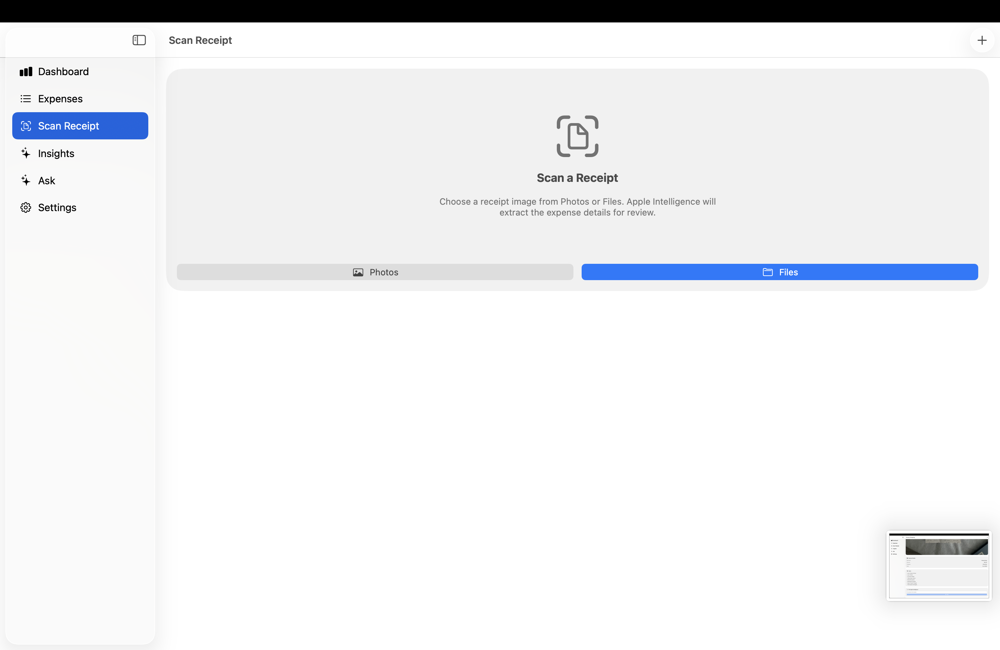
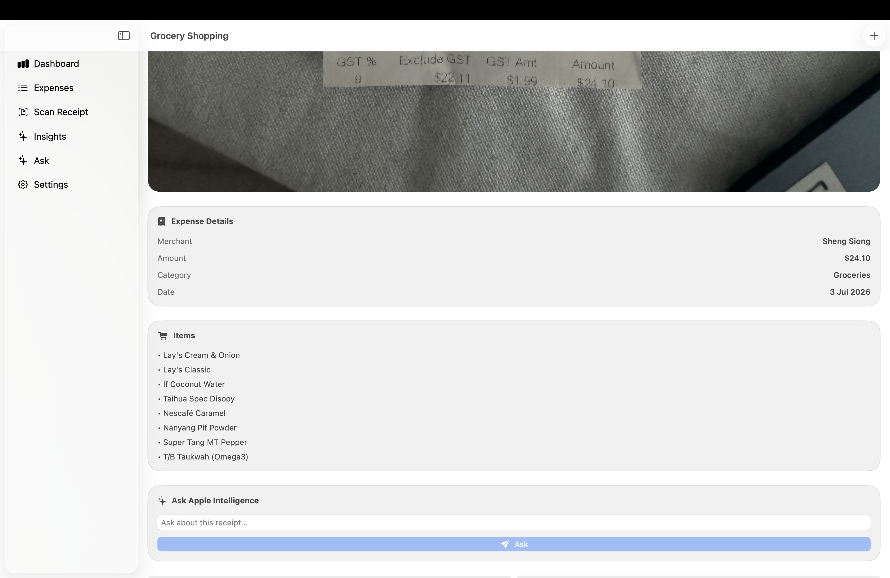
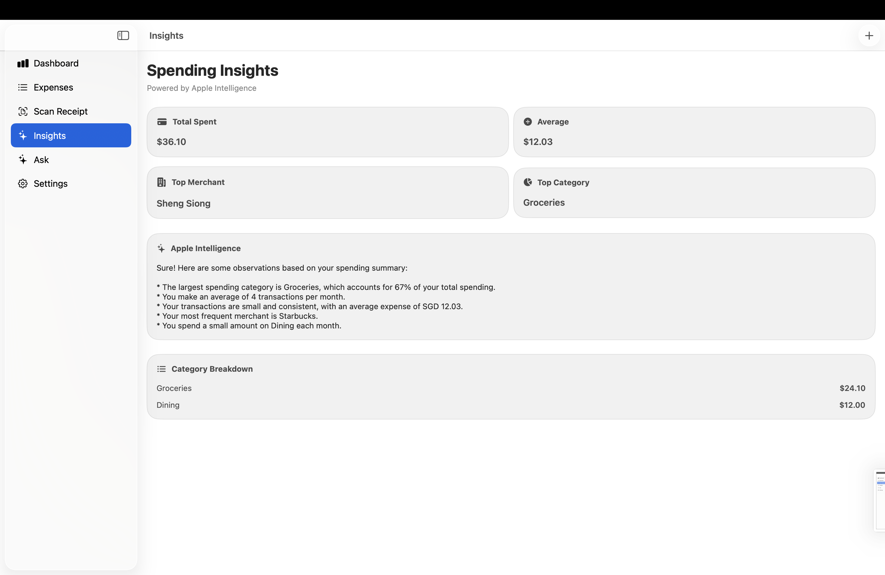
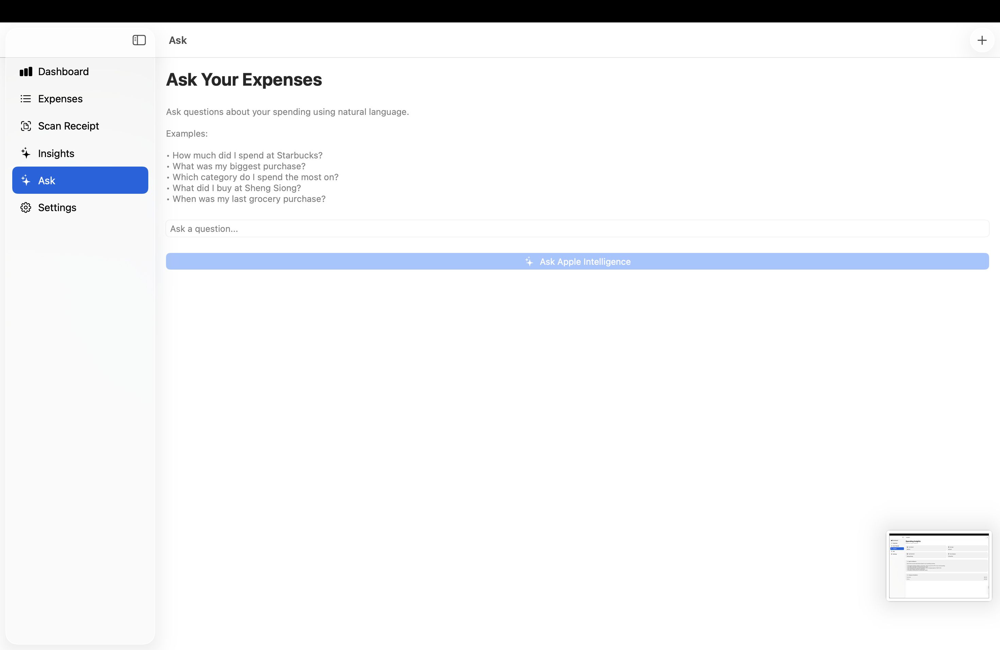

# Budgetting

> An AI-powered native expense management application built with SwiftUI, SwiftData, Vision OCR, and Apple Foundation Models.

<p align="center">


</p>

---

## Overview

Budgetting is a modern native expense management application designed for Apple platforms.

Instead of manually entering expenses, users simply scan a receipt. The application uses Apple's Vision framework to extract text, Foundation Models to understand the receipt, and SwiftData to store structured expense information locally.

Beyond receipt scanning, Budgetting provides AI-generated spending insights and allows users to ask natural language questions about their expenses using Apple's on-device Foundation Models.

The project was built to explore modern Apple platform development while demonstrating production-oriented engineering practices including MVVM architecture, accessibility, Swift Testing, and native platform integrations.

---

# Features

## AI Receipt Scanning

- Scan receipts directly from Photos or Files
- Optical Character Recognition using Vision
- AI-powered receipt understanding using Foundation Models
- Automatic extraction of:
  - Merchant
  - Total amount
  - Category
  - Purchased items
- Review and edit extracted information before saving

---

## Expense Management

- Store expenses using SwiftData
- Edit existing expenses
- Delete expenses
- Search expenses
- Filter by category
- Store original receipt images
- Preserve OCR text for future AI queries

---

## Dashboard

- Monthly spending summary
- Budget progress ring
- Spending by category
- Largest spending category
- Spending insights generated using Apple Intelligence

---

## Apple Intelligence

### AI Receipt Parsing

Transforms raw OCR text into structured expense information using Apple's Foundation Models.

### Spending Insights

Generates personalised insights based on spending behaviour rather than generic financial advice.

### Ask About Your Receipt

Users can ask natural language questions such as:

- What did I buy?
- How much did I spend?
- Which merchant was this from?
- Summarise this receipt.
- Was this mostly groceries or household items?

---

# Screenshots

## Dashboard



---

## Expense List



---

## Receipt Scanner



---

## Expense Detail



---

## AI Insights



---

## Ask Apple Intelligence



---

# Architecture

```
                     SwiftUI Views
                           │
                           ▼
                     ViewModels (MVVM)
                           │
        ┌──────────────────┼──────────────────┐
        ▼                  ▼                  ▼
 Receipt Parser      Expense Services      AI Services
        │                  │                  │
        ▼                  ▼                  ▼
 Vision OCR          SwiftData         Foundation Models
```

---

# Technology Stack

### Languages

- Swift

### UI

- SwiftUI

### Persistence

- SwiftData

### Artificial Intelligence

- Apple Foundation Models
- LanguageModelSession

### OCR

- Vision Framework

### Charts

- Swift Charts

### Concurrency

- Swift Concurrency
- async / await

### Testing

- Swift Testing
- XCUITest

### Architecture

- MVVM

### Accessibility

- VoiceOver support
- Accessibility labels
- Accessibility hints

---

# Engineering Highlights

This project demonstrates:

- Native Apple platform development
- Modern SwiftUI architecture
- On-device AI integration
- OCR document processing
- Local-first data persistence
- Receipt image storage
- Natural language querying
- Unit testing
- UI testing
- Accessibility support

---

# Testing

The project includes automated tests covering:

- Dashboard calculations
- Expense analysis
- Receipt parsing
- Business logic
- UI launch tests

---

# Future Improvements

- CloudKit synchronisation
- Widgets
- Apple Wallet transaction import
- Recurring expense detection
- REST API synchronisation
- Intelligent budget forecasting
- Multi-device synchronisation

---

# Requirements

- Xcode 26+
- iOS 26+
- macOS 26+
- Apple Foundation Models supported device
